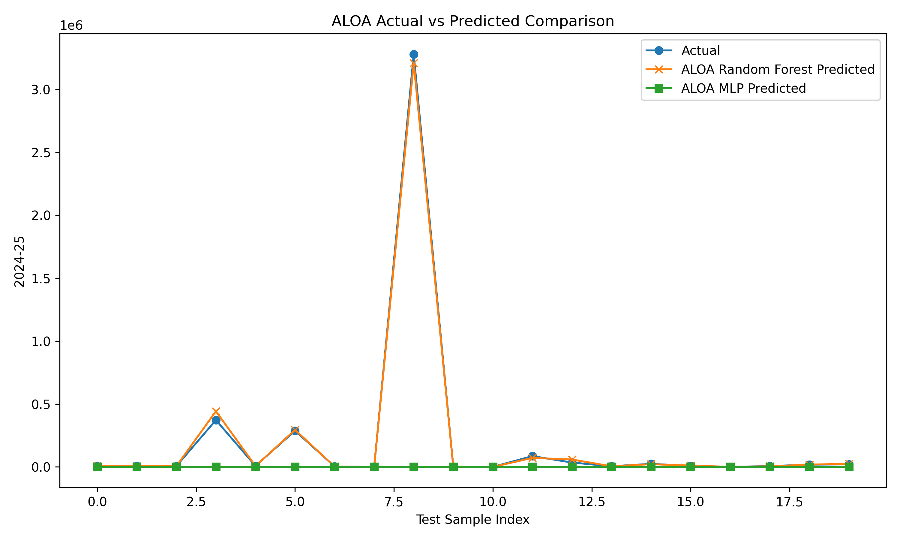

# 🧪 Chemical Production Forecasting System

## 🧠 Production Forecasting using Machine Learning & Bio-Inspired Optimization

---

## 👤 Author

**Sagnik Patra**

---

## 📌 Project Overview

This project builds an end-to-end **Chemical Production Forecasting System** using Machine Learning and Bio-Inspired Optimization Algorithms.

The system analyzes major chemical production data, performs feature engineering, applies optimization-based feature selection, and predicts chemical production values using optimized machine learning models.

The project automatically generates:

- Prediction CSV files
- Result CSV files
- H5 data files
- PKL model files
- YAML configuration files
- JSON result files
- Accuracy reports
- Visualization graphs
- Heatmaps
- Optimization progress graphs

---



---

## 🎯 Objectives

- Analyze chemical production trends
- Predict chemical production values using machine learning
- Perform feature engineering on production data
- Optimize feature selection using bio-inspired algorithms
- Generate prediction and result reports
- Save trained models and configuration files
- Visualize model performance and optimization progress

---

## ⚙️ Tech Stack

- Python
- Pandas
- NumPy
- Scikit-learn
- Matplotlib
- Seaborn
- Joblib
- YAML
- JSON
- H5PY

---

## 🧬 Optimization Algorithm Used

- ALOA - Ant Lion Optimization Algorithm

---

## 📂 Dataset

```text
Production_of_Major_Chemicals_2024-25_1_0.csv
